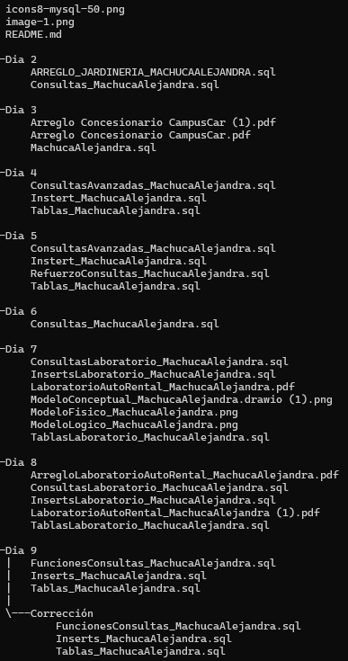

# MYSQL

### En este repositorio encontrarás los trabajos asignados y ejemplos realizados en clase por el Trainer.

## Descripción

### Se crearon bases de datos, insersiones de datos y consultas para aprender y repasar.

## Tecnologías utilizadas
| MySQL |
|--|
|

## Estructura del proyecto

## Características
| Carpeta | Descripción |
|--|--|
|Dia 2| Contiene dos archivos [sql] que contienen el código y arreglos del código, consultas realizadas en clase y asignadas como trabajo a realizar.|
|Dia 3| Contiene dos archivos [pdf] que nos muestra un informe sobre la base de datos realizada y un archivo [sql] donde se representa dicha base de datos con su código.|
|Dia 4| Contiene tres archivos [sql] donde en uno está la creación de tablas, en otro los inserts de datos y en el último están las consultas asiganadas como trabajo de clase y las que fueron realizadas en clase por el Trainer.|
|Dia 5| Contiene cuatro archivos [sql] que están divididos en la creación de tablas, las inserciones de datos, consultas realizadas por el Trainer en clase y por último las consultas asignadas como trabajo de estudio.|
|Dia 6| Contiene un archivo [sql] que fue utilizado para la realización de consultas asignadas como trabajo en clase.|
|Dia 7| Contiene tres archivos [sql] que están divididos en la creación de tablas, inserción de datos y consultas. Aparte de esto, hay un archivo pdf con la documentación requerida y tres archivos png que son los diseños de modelos conceptual, fisico y lógico.|
|Dia 8| Contiene tres archivos [sql] que están divididos en la creación de tablas, inserción de datos y consultas. Además, hay dos archivos pdf, donde ambos tienen la misma documenración requerida, pero "ArregloLaboratorioAutoRental_MachucaAlejandra" tiene un arreglo de diseño.|
|Dia 9| Contiene tres archivos [sql] que están divididos en la creación de tablas, inserción de datos y creación de consultas con funciones. En la carpeta "Corrección" existen los mismos tres archivos, pero el sql "FuncionesConsultas_MachucaAlejandra" contiene la corrección y la realización de las funciones asignadas en clase como Quiz.|

## Instrucciones

1. Ingresamos a uno de los archivos que están en este repositorio
2. Copiamos el código y lo pegamos en MySQL
3. A continuación, seleccionamos el primer botón si queremos verificar el código en su totalidad y el segundo botón si queremos revisar por filas.

    

## Desarrollado por

Los trabajos fueron realizados por Alejandra Machuca, estudiante de CampusLands como proyectos asignados en clase.